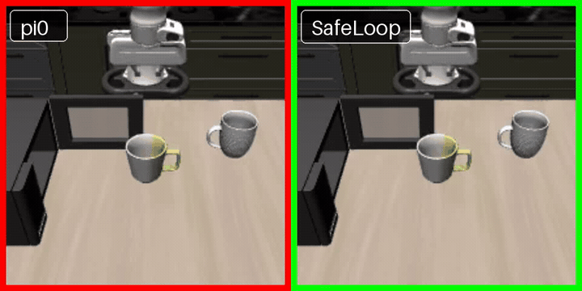

# SafeLoop: Risk-Aware Rollback for Vision-Language-Action Manipulation

SafeLoop is an outer-loop safety controller for frozen manipulation policies. It
predicts near-future body/stuck and object hazards, records safe trajectory
anchors, executes motion-planned rollback, and resumes the base policy from the
recovered state.

The released implementation uses a Pi0 LIBERO policy, a frozen
Qwen2.5-VL-3B backbone with a compact multitask prediction head, and a
three-action decision head over `noop`, `record`, and `rollback`.

- Weights: [Jaqen0-0/SafeLoop](https://huggingface.co/Jaqen0-0/SafeLoop)
- Training data: [Jaqen0-0/SafeLoop-Training-Data](https://huggingface.co/datasets/Jaqen0-0/SafeLoop-Training-Data)
- Pinned artifact manifest: [`configs/release/artifacts_pi0_v1.json`](configs/release/artifacts_pi0_v1.json)

## Demo



The left rollout uses the frozen Pi0 policy. The right rollout uses the same
policy with SafeLoop; the controller records a safe anchor, rolls back, and
resumes policy execution.

## Components

```text
safety_guard/
  controller.py                 SafeLoop controller and rollback interface
  memory.py                     safe-anchor memory
  libero_motion.py              LIBERO rollback motion planning
  qwen_multitask.py             predictor dataset, head, loss, and inference
  rl_policy_decider.py          noop/record/rollback decision policy
  online_rl.py                  online decision-head optimization

scripts/
  quickstart_pi0_safeloop.sh             one-task Pi0 + SafeLoop rollout
  download_release_weights.py            pinned weight download and SHA256 check
  check_release_environment.py           dependency, submodule, and asset checks
  evaluate_pi0_safeguard_closed_loop.py  rollout and data collection
  run_release_predictor_training.py      predictor training recipes
  run_release_decider_training.py        decision-head training recipe
  run_release_24task_eval.py              configurable LIBERO evaluation runner

third_party/
  LIBERO/                                 pinned simulator submodule
  openpi/                                 pinned Pi0 policy/client submodule
```

The release has been validated on Linux with Python 3.10, CUDA 12.4, and an
NVIDIA H20 GPU. Python package versions are pinned in
[`pyproject.toml`](pyproject.toml) and
[`requirements/libero-eval.txt`](requirements/libero-eval.txt).

## Installation

Install the system packages required by Python virtual environments, video
export, and headless MuJoCo rendering:

```bash
sudo apt-get update
sudo apt-get install -y python3.10 python3.10-venv git ffmpeg libegl1 libgl1 libglfw3 libosmesa6
```

Clone the Pi0-only release and create its environment:

```bash
git clone --branch release/safeloop --recurse-submodules https://github.com/Loule0-0/SafeLoop.git
cd SafeLoop
bash scripts/setup_release_env.sh
source .venv/bin/activate
```

Download the pinned Qwen model:

```bash
export QWEN_MODEL="$PWD/.artifacts/Qwen2.5-VL-3B-Instruct"
hf download Qwen/Qwen2.5-VL-3B-Instruct \
  --revision 66285546d2b821cf421d4f5eb2576359d3770cd3 \
  --local-dir "$QWEN_MODEL"
```

Download the Pi0 LIBERO checkpoint through the pinned OpenPI code:

```bash
export OPENPI_ROOT="$PWD/third_party/openpi"
export PI0_CHECKPOINT_DIR="$(
  cd "$OPENPI_ROOT"
  uv run python -c \
    'from openpi.shared import download; print(download.maybe_download("gs://openpi-assets/checkpoints/pi0_libero"))'
)"
```

The SafeLoop predictor and decision weights are downloaded automatically by the
Quickstart. To download or validate them separately:

```bash
export SAFELOOP_WEIGHTS="$PWD/.artifacts/safeloop_weights"
python scripts/download_release_weights.py --output-dir "$SAFELOOP_WEIGHTS"
python scripts/download_release_weights.py --output-dir "$SAFELOOP_WEIGHTS" --check-only
```

## Quickstart

Run the Pi0 + SafeLoop example for LIBERO-10 task 9, seed 214:

```bash
export QWEN_MODEL="$PWD/.artifacts/Qwen2.5-VL-3B-Instruct"
export PI0_CHECKPOINT_DIR=/path/to/cached/pi0_libero
bash scripts/quickstart_pi0_safeloop.sh
```

The script verifies all eight released SafeLoop checkpoints, starts the Pi0
websocket policy server, checks the environment and endpoint, and writes the
rollout summary and video under `outputs/quickstart/`.

Useful overrides:

```bash
SAFELOOP_TASK=libero_10:6 SAFELOOP_SEED=389 \
POLICY_CUDA_VISIBLE_DEVICES=0 SAFELOOP_CUDA_VISIBLE_DEVICES=0 \
bash scripts/quickstart_pi0_safeloop.sh
```

Set `SAFELOOP_START_POLICY_SERVER=0` to use an existing policy server at
`POLICY_HOST:POLICY_PORT`.

## Start the Pi0 Server Manually

```bash
cd "$OPENPI_ROOT"
uv sync --frozen
CUDA_VISIBLE_DEVICES=0 uv run scripts/serve_policy.py policy:checkpoint \
  --policy.config=pi0_libero \
  --policy.dir="$PI0_CHECKPOINT_DIR"
```

Validate the endpoint from the SafeLoop environment:

```bash
python scripts/check_release_environment.py \
  --scope eval \
  --check-policy-server \
  --policy-host 127.0.0.1 \
  --policy-port 8000
```

## Evaluation

The default profile contains 24 configured LIBERO tasks and 16 seeds per task.
Each suite uses the rollout horizon from the pinned OpenPI LIBERO evaluator.

```bash
python scripts/run_release_24task_eval.py \
  --model-dir "$QWEN_MODEL" \
  --weights-dir "$SAFELOOP_WEIGHTS" \
  --output-root "$SAFELOOP_OUTPUT/eval_24task" \
  --libero-root "$PWD/third_party/LIBERO" \
  --openpi-root "$OPENPI_ROOT" \
  --checkpoint-dir "$PI0_CHECKPOINT_DIR"
```

Run a single task or a single seed without editing the config:

```bash
python scripts/run_release_24task_eval.py \
  --model-dir "$QWEN_MODEL" \
  --weights-dir "$SAFELOOP_WEIGHTS" \
  --output-root "$SAFELOOP_OUTPUT/smoke" \
  --task libero_10:9 \
  --seeds 214 \
  --dry-run
```

Use `--profile base_policy_reference` to disable SafeLoop with the same task and
seed selection.

## Predictor Training

Materialize the released training data:

```bash
export SAFELOOP_DATA="$PWD/.artifacts/safeloop_training_data"
hf download Jaqen0-0/SafeLoop-Training-Data \
  --repo-type dataset \
  --local-dir "$SAFELOOP_DATA"
python scripts/materialize_hf_training_data.py \
  --dataset-dir "$SAFELOOP_DATA" \
  --out "$SAFELOOP_DATA/materialized"
```

Run all pinned predictor stages:

```bash
python scripts/run_release_predictor_training.py \
  --dataset-dir "$SAFELOOP_DATA" \
  --data-root "$SAFELOOP_DATA/materialized" \
  --model-dir "$QWEN_MODEL" \
  --weights-dir "$SAFELOOP_WEIGHTS" \
  --output-root "$SAFELOOP_OUTPUT"
```

The staged recipe definitions and initialization checkpoints are in
[`configs/release/v56_predictor_training.json`](configs/release/v56_predictor_training.json).

## Decision-Head Training

With the Pi0 policy server active:

```bash
python scripts/run_release_decider_training.py \
  --model-dir "$QWEN_MODEL" \
  --weights-dir "$SAFELOOP_WEIGHTS" \
  --output-root "$SAFELOOP_OUTPUT" \
  --libero-root "$PWD/third_party/LIBERO" \
  --openpi-root "$OPENPI_ROOT" \
  --checkpoint-dir "$PI0_CHECKPOINT_DIR" \
  --policy-host 127.0.0.1 \
  --policy-port 8000
```

The reward terms, initialization checkpoint, task sequence, and optimizer
settings are stored in
[`configs/release/v56_decider_training.json`](configs/release/v56_decider_training.json).

## Tests

```bash
python -m pytest -q
```

## License

SafeLoop is released under the [Apache License 2.0](LICENSE). The pinned LIBERO
and OpenPI submodules retain their own licenses.
